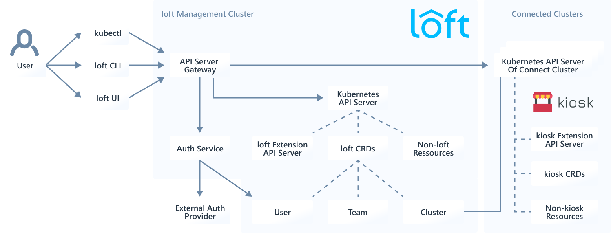

<h1></h1>

### **[Website](https://loft.sh/)** • **[Getting Started](https://loft.sh/docs/getting-started/setup)** • **[Architecture](#architecture)** • **[Documentation](https://loft.sh/docs/introduction)**

## Multi-Tenancy Manager For Kubernetes
- **Accounts & Account Users** to separate tenants in a shared Kubernetes cluster
- **Self-Service Namespace Provisioning** for account users
- **Account Limits** to ensure quality of service and fairness when sharing a cluster
- **Namespace Templates** for secure tenant isolation and self-service namespace initialization
- **Multi-Cluster Tenant Management** for sharing a pool of clusters

 

## Architecture

 
