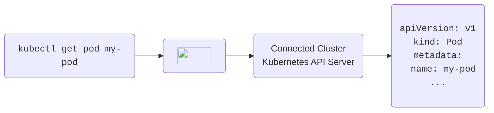

import Tabs from '@theme/Tabs';
import TabItem from '@theme/TabItem'

import FragmentSleepConfigureUI from '../fragments/sleep/configure-ui.mdx'
import FragmentSleepEnforceUI from '../fragments/sleep/enforce-ui.mdx'
import FragmentSleepManualUI from '../fragments/sleep/manual-ui.mdx'
import FragmentSleepManualCLI from '../fragments/sleep/manual-cli.mdx'
import FragmentSleepScheduleUI from '../fragments/sleep/schedule-ui.mdx'
import FragmentSleepWakeUI from '../fragments/sleep/wake-ui.mdx'
import FragmentSleepWakeCLI from '../fragments/sleep/wake-cli.mdx'
import FragmentSleepWakeKubectl from '../fragments/sleep/wake-kubectl.mdx'
import FragmentAutoDeleteEnforceUI from '../fragments/auto-delete/enforce-ui.mdx'
import FragmentAutoDeleteConfigureUI from '../fragments/auto-delete/configure-ui.mdx'


Loft provides two powerful features to reduce Kubernetes cost:
- [Sleep Mode](#sleep-mode) which puts namespaces to sleep when nobody is using them, i.e. purging all pods while keeping all resources inside the namespaces during periods of inactivity
- [Auto-Delete](#auto-delete) which deletes namespaces that have been idle for a while

Both of these feature typically rely on Loft's [inactivity detection](#inactivity-detection).


## Working with Sleep Mode
With sleep mode, you can put Kubernetes namespaces to sleep which means that Loft will set `replicas: 0` for all replica-controlled resources such as `Deployments` and `StatefulSets`. This means that Kubernetes will delete all pods but the entire configuration of resources within the namespace is still there.

Sleep mode can be:
- Invoked manually
- Triggered by an inactivity timeout (no one has ran a `kubectl` command in this namespace for X minutes)
- Scheduled using a CRON syntax


### Manual + Automatic Sleep / Wake-up

<details>
  <summary>Start Sleep (manual)</summary>
  <Tabs
    defaultValue="ui"
    values={[
      {label: 'UI', value: 'ui'},
      {label: 'CLI', value: 'cli'},
    ]}>
    <TabItem value="ui"><FragmentSleepManualUI/></TabItem>
    <TabItem value="cli"><FragmentSleepManualCLI/></TabItem>
  </Tabs>

:::tip Automatic Wakeup
Note that the space will automatically wake up again, once you run a kubectl command within the space.
:::

</details>

<details>
  <summary>Automatic Sleep Mode (individual space)</summary>
  <FragmentSleepConfigureUI/>
</details>

<details>
  <summary>Wake up space</summary>
  <Tabs
    defaultValue="ui"
    values={[
      {label: 'UI', value: 'ui'},
      {label: 'CLI', value: 'cli'},
      {label: 'kubectl', value: 'kubectl'},
    ]}>
    <TabItem value="ui"><FragmentSleepWakeUI/></TabItem>
    <TabItem value="cli"><FragmentSleepWakeCLI/></TabItem>
    <TabItem value="kubectl"><FragmentSleepWakeKubectl/></TabItem>
  </Tabs>
</details>


### Scheduled Sleep / Wake-up

<details>
  <summary>Scheduled Sleep & Wake-Up (individual space)</summary>
  <FragmentSleepScheduleUI/>
</details>


### Enforce Sleep Settings

<details>
  <summary>Enforce Sleep Mode For <u>All</u> Spaces Created By User/Team</summary>
  <FragmentSleepEnforceUI/>
</details>


## Working with Auto-Delete
Loft lets you configure an auto-delete for namespaces that have not been used for a certain period of time (inactivity).

<details>
  <summary>Configure Auto-Delete Timeout (individual space)</summary>
  <FragmentAutoDeleteConfigureUI/>
</details>

<details>
  <summary>Enforce Auto-Delete Timeout For <u>All</u> Space Created By User/Team</summary>
  <FragmentAutoDeleteEnforceUI/>
</details>


## Inactivity Detection
All requests that are made through Loft count as activity in the namespace. 



If your kube-context points to Loft's API server as a proxy before the actual connected cluster's API server, every `kubectl` request will be an activity and reset the inactivity timeout.


## Configuration
Sleep mode is generally configured as annotations on the namespace.
- `sleepmode.loft.sh/sleep-after`: tells Loft to trigger sleep mode automatically after x seconds of inactivity
- `sleepmode.loft.sh/delete-after`: tells Loft to delete the namespace automatically after x seconds of inactivity
- `sleepmode.loft.sh/force`: if "true" tells Loft to force sleep this namespace
- `sleepmode.loft.sh/force-duration`: the amount of seconds after the space starts sleeping after which no automatic wake up should occur (a value of 0 means infinite). This can be useful if there is an application accessing the space that would directly wake up the space again after it started sleeping.
- `sleepmode.loft.sh/delete-all-pods`: if "true" will delete all running pods within a namespace as soon as it starts sleeping, besides scaling down deployments, replicasets and statefulsets

Loft checks every space with an automatic sleep mode annotation in a fixed interval of 1 minute.


### Exclude Resources From Sleep
Loft allows you to specify resources that should not sleep within a space by providing the annotation `sleepmode.loft.sh/exclude: 'true'` on either a `Deployment`, `StatefulSet`, `ReplicaSet` or `Pod`. For example the following `Deployment` would not sleep if the space is sleeping:
```yaml
apiVersion: apps/v1
kind: Deployment
metadata:
  name: test
  annotations:
    sleepmode.loft.sh/exclude: 'true'
spec:
  replicas: 2
  selector:
    matchLabels:
      app: test
  template:
    metadata:
      labels:
        app: test
    spec:
      containers:
        - name: busybox
          image: busybox
          command:
            - sleep
            - '3600'
```


### Refine Activity Detection
There are multiple annotations you can set on a namespace to change what counts as activity within that namespace:
- `sleepmode.loft.sh/last-activity`: this is usually set automatically by Loft after an activity was detected within a namespace, however you can also change this value as you like
- `sleepmode.loft.sh/ignore-all`: if this annotation is set to "true", then all requests will be ignored and not count as activity
- `sleepmode.loft.sh/ignore-vclusters`: if "true", activity that occurs within a created vcluster within this namespace does not count as activity
- `sleepmode.loft.sh/ignore-groups`: a comma separated list of user groups that do not count as activity (e.g. loft:team:admins would ignore all users in the team admins or loft:user:admin would ignore the admin user)
- `sleepmode.loft.sh/ignore-resources`: a comma separated list of kubernetes resources that do not count as activity (e.g. pods, deployments.apps, secrets etc.)
- `sleepmode.loft.sh/ignore-verbs`: a comma separated list of kubernetes verbs that do not count as activity (e.g. get, list, create, update, patch, delete)
- `sleepmode.loft.sh/ignore-resource-verbs`: a comma separated list of resources and verbs that do not count as activity (format: myresource.mygroup=create update delete,myresource2.mygroup=create update)
- `sleepmode.loft.sh/ignore-resource-names`: a comma separated list of resources and names that do not count as activity (format: myresource.mygroup=name1 name2)
- `sleepmode.loft.sh/ignore-active-conntections`: if this annotation is set to "true", then still active kubernetes connections will be ignored for determining activity in a space 

If you want to set some of this annotations automatically on space creation, you can add these to the space template in the account settings.


### Long-Living Connections
It's possible that certain requests such as `kubectl exec` or `kubectl port-forward` keep an active connection open to the space that prevents it from sleeping. This is in most cases wanted since the space shouldn't start sleeping when someone is still clearly using it, however there are cases where the connection might be idle (someone left the laptop open, but is not using it anymore) in which you want to terminate such connections and put the space to sleep.

There are multiple ways to approach this problem of active connections preventing a space from sleeping:
1. You can tell loft to timeout idle streaming connections (such as `kubectl exec`, `kubectl port-forward` etc.) after a certain time period with the annotation `loft.sh/streaming-connection-idle-timeout: '3600'` on a **cluster**. With this annotation set, loft will close connections automatically that are idle after the given seconds. By default, Loft will not timeout any connections. This will only apply to new opened connections to that cluster and not affect already running connections. 
<figure class="frame">
    
    <figcaption>Set annotation on cluster</figcaption>
</figure>

2. Tell loft to ignore all active connections for determining space activity via the space annotation `sleepmode.loft.sh/ignore-active-conntections: 'true'`. This will put a space to sleep even though there still might be open connections such as `kubectl exec` or `kubectl port-forward`.
3. Configure your kubelets with the flag `--streaming-connection-idle-timeout duration`(see [docs](https://kubernetes.io/docs/reference/command-line-tools-reference/kubelet/)). This behaves essentially as option 1, however this configuration is Loft independent.
