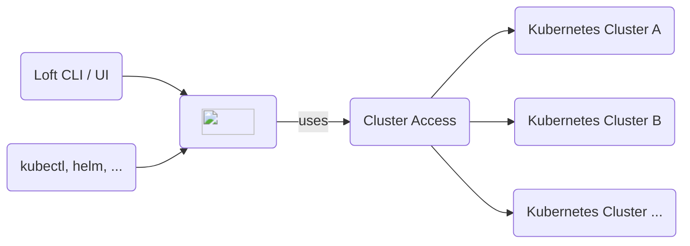

import NavStep from '@site/src/components/NavStep'
import Button from '@site/src/components/Button'
import Label from '@site/src/components/Label'
import Input from '@site/src/components/Input'
import Flow, { Step } from '@site/src/components/Flow'
import CreateSpaceStep1 from '@site/static/media/ui/screenshots/auth/login/login.png';
import CreateSpaceStep2 from '@site/static/media/ui/screenshots/spaces/create-space/button-open-drawer.png'
import PartialClusterAccessCreateUI from '../clusters/_partials/cluster-access/create-ui.mdx'

Cluster access allows you to give certain Users and Teams direct permission to a cluster without assigning them to a project. This is usually only useful for admin users or special privileged teams, while in all other cases you should prefer projects.

 

Cluster access lets you define access to certain clusters for your users or teams along with the cluster roles that would be synced for them in the connected cluster. You can create your own Cluster Access by following the below steps.

### Creating a Cluster Access

<Flow id="create-clusteraccess-ui">
  <Step>
    Go to the <NavStep>Clusters</NavStep> view using the menu on the left.
  </Step>
  <Step>
    Click the <NavStep>Cluster Access</NavStep> option on the Clusters pane and then Click on the <Button>Create Cluster Access</Button> button at the very right.
  </Step>
  <Step>
    In the drawer that appears from the right, give the access a name by replacing the auto-generated placeholder name, or by updating the manifest YAML 'metadata.name' field.
  </Step>
  <Step>
    In the <Label>Options</Label> configuration pane, please choose the User or Team you wish to grant the access, from the <Label>Cluster Access ...</Label> drop down menu. Subsequently choose the cluster role to be assigned to the selected user or team from the <Label>Cluster Roles ...</Label> drop down menu.
  </Step>
  <Step>
    In the <Label>Clusters</Label> configuration pane, please choose the cluster to which the User or Team should be granted access, from the <Label>Select Clusters ...</Label> drop down menu.
  </Step>
  <Step>
    In the <Label>Access</Label> configuration pane, Select the User or Team that should have access to the underlying cluster access object, from the <Label>User & Teams ...</Label> drop down menu. Choose what actions they are allowed to perform on this object, from the <Label>Permissions ...</Label> drop down menu.
  </Step>
  <Step>
    Click on the <Button>Save Changes</Button>  button to create the cluster access.
  </Step>
</Flow>