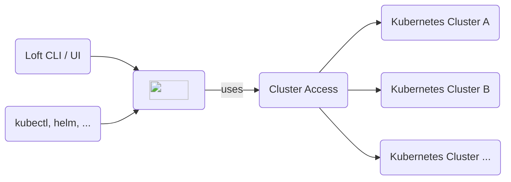

import NavStep from '@site/src/components/NavStep'
import Button from '@site/src/components/Button'
import Label from '@site/src/components/Label'
import Input from '@site/src/components/Input'
import Flow, { Step } from '@site/src/components/Flow'
import CreateSpaceStep1 from '@site/static/media/ui/screenshots/auth/login/login.png';
import CreateSpaceStep2 from '@site/static/media/ui/screenshots/spaces/create-space/button-open-drawer.png'
import PartialClusterAccessCreateUI from '../clusters/_partials/cluster-access/create-ui.mdx'

The core feature of Loft is to enable users to get self-service access to Kubernetes and allow them to create isolated namespaces and virtual clusters whenever they need them. 



This page will show you how to:
1. [Create a Test User](#1-create-test-user)
2. [Impersonate this user](#2-impersonate-user)
3. Switch back to our admin role and [give the user access to a Kubernetes cluster](#3-define-cluster-access)
4. Use impersonation again to [verify the user's access to the cluster](#4-verify-cluster-access)


## 1. Create Test User
Loft lets you connect a variety of SSO providers for authentication but for the sake of simplicity, let's just manually create a user to learn more about Loft's cluster access features:

<Flow id="create-user">
  <Step>
    Go to the <NavStep>Users</NavStep> view using the main menu on the left
  </Step>
  <Step>
    Click on the <Button>Add User</Button> button
  </Step>
  <Step>
    Use the field <Label>Display Name</Label> to enter the value <Input>Anna</Input>
  </Step>
  <Step image="">
    Click on the <Button>Create</Button> button at the very bottom
  </Step>
  <Step image="">
    Close the popup using the button <Button>Copy & Close</Button>
  </Step>
</Flow>

:::tip 100% Kubernetes Native
Remember: Everything you do in Loft UI, including creating a user, is effectively a kubectl command under the hood. So, everything you do in this guide creates or changes objects in your cluster and you could also manage these actions via kubectl or any kind of GitOps tool.
:::

## 2. Impersonate User
Loft allows admins with appropriate RBAC permissions to impersonate users. Let's try this to see how Loft UI would look like for our newly created user:

<Flow id="impersonate-user">
  <Step>
    In the <NavStep>Users</NavStep> view, hover over the row with user <b>Anna</b>
  </Step>
  <Step>
    While hovering over the row, you will see buttons appear on the right in the <Label>Actions</Label> column
  </Step>
  <Step>
    Click on the <Button><svg viewBox="64 64 896 896" focusable="false" data-icon="user-switch" width="1em" height="1em" fill="currentColor" aria-hidden="true"><defs><style></style></defs><path d="M759 335c0-137-111-248-248-248S263 198 263 335c0 82.8 40.6 156.2 103 201.2-.4.2-.7.3-.9.4-44.7 18.9-84.8 46-119.3 80.6a373.42 373.42 0 00-80.4 119.5A373.6 373.6 0 00136 874.8a8 8 0 008 8.2h59.9c4.3 0 7.9-3.5 8-7.8 2-77.2 32.9-149.5 87.6-204.3C356 614.2 431 583 511 583c137 0 248-111 248-248zM511 507c-95 0-172-77-172-172s77-172 172-172 172 77 172 172-77 172-172 172zm105 221h264c4.4 0 8-3.6 8-8v-56c0-4.4-3.6-8-8-8H703.5l47.2-60.1a8.1 8.1 0 001.7-4.9c0-4.4-3.6-8-8-8h-72.6c-4.9 0-9.5 2.3-12.6 6.1l-68.5 87.1c-4.4 5.6-6.8 12.6-6.8 19.8.1 17.7 14.4 32 32.1 32zm240 64H592c-4.4 0-8 3.6-8 8v56c0 4.4 3.6 8 8 8h176.5l-47.2 60.1a8.1 8.1 0 00-1.7 4.9c0 4.4 3.6 8 8 8h72.6c4.9 0 9.5-2.3 12.6-6.1l68.5-87.1c4.4-5.6 6.8-12.6 6.8-19.8-.1-17.7-14.4-32-32.1-32z"></path></svg></Button> button to <Label>Impersonate</Label> the user
  </Step>
  <Step image="">
    In the popup, click on the <Button>Impersonate</Button> button to confirm that you want to start impersonation
  </Step>
  <Step image="">
    After impersonation has started, go to the <NavStep>Clusters</NavStep> view using the main menu on the left
  </Step>
  <Step image="">
    Verify that Anna has no access to any clusters
  </Step>
</Flow>

To also use Loft CLI as the impersonated user, you can run the following command while impersonation is active:
```bash
loft login localhost:9898 --insecure    # or use your loft.domain.tld instead of localhost, and ideally with a valid SSL cert and without the --insecure flag
```

You can verify the login and print your user information via:
```bash
loft login
```


## 3. Configure Cluster Access
Let's give our test user Anna access to one of the clusters connected to this Loft instance:

<PartialClusterAccessCreateUI/>

:::note Single Sign-On + Cluster Access
You can connect a variety of SSO providers to Loft. To automatically give users access to clusters based on their SSO user groups, you can switch to the <Label>Team Members</Label> tab to grant cluster access for each member of a team (e.g. for each member of a group in Active Directory, Okta, SAML, etc.)
:::


## 4. Verify Cluster Access
After configuring the cluster access for test user Anna, let's verify that she can access the cluster:

<Flow id="verify-cluster-access">
  <Step>
    Go to the <NavStep>Users</NavStep> view using the main menu on the left
  </Step>
  <Step>
    Hover over the row with user <b>Anna</b> and click on the <Button><svg viewBox="64 64 896 896" focusable="false" data-icon="user-switch" width="1em" height="1em" fill="currentColor" aria-hidden="true"><defs><style></style></defs><path d="M759 335c0-137-111-248-248-248S263 198 263 335c0 82.8 40.6 156.2 103 201.2-.4.2-.7.3-.9.4-44.7 18.9-84.8 46-119.3 80.6a373.42 373.42 0 00-80.4 119.5A373.6 373.6 0 00136 874.8a8 8 0 008 8.2h59.9c4.3 0 7.9-3.5 8-7.8 2-77.2 32.9-149.5 87.6-204.3C356 614.2 431 583 511 583c137 0 248-111 248-248zM511 507c-95 0-172-77-172-172s77-172 172-172 172 77 172 172-77 172-172 172zm105 221h264c4.4 0 8-3.6 8-8v-56c0-4.4-3.6-8-8-8H703.5l47.2-60.1a8.1 8.1 0 001.7-4.9c0-4.4-3.6-8-8-8h-72.6c-4.9 0-9.5 2.3-12.6 6.1l-68.5 87.1c-4.4 5.6-6.8 12.6-6.8 19.8.1 17.7 14.4 32 32.1 32zm240 64H592c-4.4 0-8 3.6-8 8v56c0 4.4 3.6 8 8 8h176.5l-47.2 60.1a8.1 8.1 0 00-1.7 4.9c0 4.4 3.6 8 8 8h72.6c4.9 0 9.5-2.3 12.6-6.1l68.5-87.1c4.4-5.6 6.8-12.6 6.8-19.8-.1-17.7-14.4-32-32.1-32z"></path></svg></Button> button to <Label>Impersonate</Label> the user
  </Step>
  <Step>
    In the popup, click on the <Button>Impersonate</Button> button to confirm that you want to start impersonation
  </Step>
  <Step image="">
    Go to the <NavStep>Clusters</NavStep> view using the main menu on the left
  </Step>
  <Step image="">
    Verify that <b>Anna</b> now has access to the clusters you specified in her cluster access
  </Step>
</Flow>

:::tip Next Steps
With access to a cluster, users can typically:
- **[Create Spaces](../getting-started/explore/spaces.mdx)**
- **[Create Virtual Clusters](../getting-started/explore/virtual-clusters.mdx)**

Loft allows you to:
- **[Configure sleep mode for spaces](../getting-started/explore/sleep-mode.mdx)** to save Kubernetes cost
- **[Restrict cluster access for users](../getting-started/explore/restricting-access.mdx)** via Space Constraints and Quotas
:::
