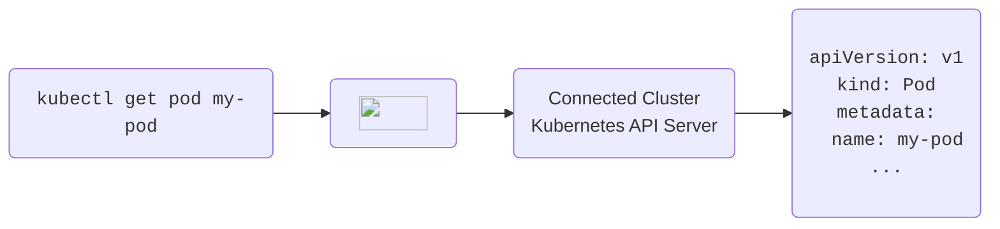

import PartialSpaceDiagramNamespace from '../spaces/_partials/diagrams/namespace.mdx'

This section is intended to give you a high level overview of some core components of Loft, this
section is not an exhaustive list, but just a simple overview of the most important features. Check out the rest of the
documentation to explore more Loft features, or install Loft yourself by
following the [installation guide](../getting-started/install).

# Projects

Projects are the highest organizational unit that Loft uses. They help logically group resources by team or
division, and as a container to apply role based access controls (RBAC). Projects will be a
central part of your Loft experience, so make sure to read more about them
[here](../projects/what-are-projects).

# Virtual Clusters

Virtual Clusters are just that, *virtual* Kubernetes clusters. These virtual clusters run inside
a namespace within the "parent" or "host" physical cluster, thereby allowing administrators to
effectively create many Kubernetes instance in a single instance -- ideal for development,
testing, and even production workloads. If you want to learn more, please take a look at the Loft virtual cluster
docs section [here](../virtual-clusters/what-are-virtual-clusters), the vcluster
project [repository](https://github.com/loft-sh/vcluster) and
[documentation](https://www.vcluster.com/docs/what-are-virtual-clusters).

# Clusters

Loft is installed into, and can connect to, as many physical Kubernetes clusters as you need to
manage. Loft can then be used to manage workloads in each of the physical clusters, deploying
spaces, virtual clusters, and apps as needed. Loft provides granular role based access control
(RBAC) allowing for Loft administrators to limit which users and teams have access to which
clusters, as well as much more granular control at the project, space, and virtual cluster levels.

Read more about Loft integration with physical clusters [here](../clusters/what-are-clusters).

# Spaces

Spaces are virtual resources that represent regular Kubernetes namespaces. Typically, non-admin
users to not have the permission to list, create or delete namespaces in a shared Kubernetes
clusters. That's why Loft adds the space resource to Kubernetes.

<PartialSpaceDiagramNamespace/>

Learn more about spaces [here](../spaces/what-are-spaces).

# Apps

Apps allow users to define applications that users can then be empowered to deploy in clusters,
spaces, and virtual clusters they have appropriate access to. The idea here is nothing new,
however, Loft's Apps interface allows for easily packaging applications, and critically,
exposing parameters that users can then select or input at deployment time. Apps can be specified via Kubernetes Manifests,
bash scripts, helm charts, etc.
Check out more about
Apps [here](../apps/what-are-apps), and be sure to learn about [versioning](../apps/versioning)
and [parameters](../apps/parameters) while you're at it!

# Cost Reduction Tools

Loft provides two powerful features to reduce Kubernetes cost:

- [Sleep Mode](#sleep-mode) which puts namespaces to sleep when nobody is using them, i.e.
purging all pods while keeping all resources inside the namespaces during periods of inactivity
- [Auto-Delete](#auto-delete) which deletes namespaces that have been idle for a while

Both of these feature typically rely on Loft's [inactivity detection](#inactivity-detection).

### Sleep Mode

With sleep mode, you can put Kubernetes namespaces to sleep which means that Loft will set
`replicas: 0` for all replica-controlled resources such as `Deployments` and `StatefulSets`.
This means that Kubernetes will delete all pods but the entire configuration of resources within
the namespace is still there.

Sleep mode can be:
- Invoked manually
- Triggered by an inactivity timeout (no one has ran a `kubectl` command in this namespace for X
minutes)
- Scheduled using a CRON syntax

### Auto-Delete

Loft lets you configure an auto-delete for namespaces that have not been used for a certain
period of time (inactivity). Learn more about this in the Space Sleep Mode
[documentation](../spaces/sleep-mode).

### Inactivity Detection

All requests that are made through Loft count as activity in the namespace.

If your kube-context points to Loft's API server as a proxy before the actual connected
cluster's API server, every `kubectl` request will be an activity and reset the inactivity timeout.
