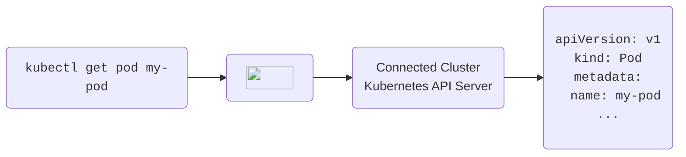

import Tabs from '@theme/Tabs';
import TabItem from '@theme/TabItem'

import PartialSleepConfigureUI from '../../spaces/_partials/sleep/configure-ui.mdx'
import PartialSleepEnforceUI from '../../spaces/_partials/sleep/enforce-ui.mdx'
import PartialSleepManualUI from '../../spaces/_partials/sleep/manual-ui.mdx'
import PartialSleepManualCLI from '../../spaces/_partials/sleep/manual-cli.mdx'
import PartialSleepScheduleUI from '../../spaces/_partials/sleep/schedule-ui.mdx'
import PartialSleepWakeUI from '../../spaces/_partials/sleep/wake-ui.mdx'
import PartialSleepWakeCLI from '../../spaces/_partials/sleep/wake-cli.mdx'
import PartialSleepWakeKubectl from '../../spaces/_partials/sleep/wake-kubectl.mdx'
import PartialAutoDeleteConfigureUI from '../../spaces/_partials/auto-delete/configure-ui.mdx'
import PartialAutoDeleteEnforceUI from '../../spaces/_partials/auto-delete/enforce-ui.mdx'

Loft provides two powerful features to reduce Kubernetes cost:
- [Sleep Mode](#sleep-mode) which puts namespaces to sleep when nobody is using them, i.e. purging all pods while keeping all resources inside the namespaces during periods of inactivity
- [Auto-Delete](#auto-delete) which deletes namespaces that have been idle for a while

Both of these feature typically rely on Loft's [inactivity detection](#inactivity-detection).

## Sleep Mode
With sleep mode, you can put Kubernetes namespaces to sleep which means that Loft will set `replicas: 0` for all replica-controlled resources such as `Deployments` and `StatefulSets`. This means that Kubernetes will delete all pods but the entire configuration of resources within the namespace is still there.

Sleep mode can be:
- Invoked manually
- Triggered by an inactivity timeout (no one has ran a `kubectl` command in this namespace for X minutes)
- Scheduled using a CRON syntax

### Manual + Automatic Sleep / Wake-up

  
Start Sleep (manual)

  <Tabs
    defaultValue="ui"
    values={[
      {label: 'UI', value: 'ui'},
      {label: 'CLI', value: 'cli'},
    ]}>
    <TabItem value="ui"><PartialSleepManualUI/></TabItem>
    <TabItem value="cli"><PartialSleepManualCLI/></TabItem>
  </Tabs>

:::tip Automatic Wakeup
Note that the space will automatically wake up again, once you run a kubectl command within the space.
:::

  
Automatic Sleep Mode (individual space)

  <PartialSleepConfigureUI/>

  
Wake up space

  <Tabs
    defaultValue="ui"
    values={[
      {label: 'UI', value: 'ui'},
      {label: 'CLI', value: 'cli'},
      {label: 'kubectl', value: 'kubectl'},
    ]}>
    <TabItem value="ui"><PartialSleepWakeUI/></TabItem>
    <TabItem value="cli"><PartialSleepWakeCLI/></TabItem>
    <TabItem value="kubectl"><PartialSleepWakeKubectl/></TabItem>
  </Tabs>

### Scheduled Sleep / Wake-up

  
Scheduled Sleep & Wake-Up (individual space)

  <PartialSleepScheduleUI/>

### Enforce Sleep Settings

  
Enforce Sleep Mode For <u>All</u> Spaces Created By User/Team

  <PartialSleepEnforceUI/>

## Auto-Delete
Loft lets you configure an auto-delete for namespaces that have not been used for a certain period of time (inactivity).

  
Configure Auto-Delete Timeout (individual space)

  <PartialAutoDeleteConfigureUI/>

  
Enforce Auto-Delete Timeout For <u>All</u> Space Created By User/Team

  <PartialAutoDeleteEnforceUI/>

## Inactivity Detection
All requests that are made through Loft count as activity in the namespace. 

If your kube-context points to Loft's API server as a proxy before the actual connected cluster's API server, every `kubectl` request will be an activity and reset the inactivity timeout.
