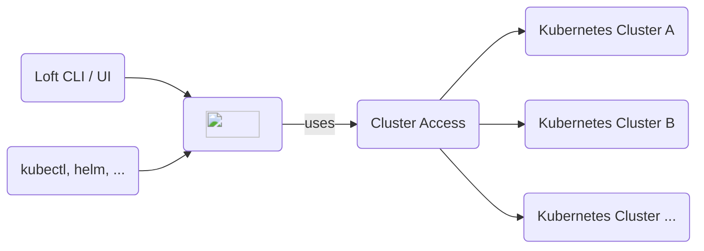

import Field from '@site/src/components/Field'
import APISpec from '@theme/ApiSchema'
import PartialClusterAccessCreateUI from '../_partials/cluster-access/create-ui.mdx'

The core feature of Loft is to enable users to get self-service access to Kubernetes and allow them to create isolated namespaces and virtual clusters whenever they need them. 

## Working with Cluster Access

  
Create Cluster Access For Individual Users

  <PartialClusterAccessCreateUI/>

:::note Single Sign-On + Cluster Access
You can connect a variety of SSO providers to Loft. To automatically give users access to clusters based on their SSO user groups, you can switch to the <Label>Team Members</Label> tab to grant cluster access for each member of a team (e.g. for each member of a group in Active Directory, Okta, SAML, etc.)
:::

## Configuration

### Metadata

#### Display Name
<Field crd="ClusterAccess" jsonPath="spec.displayName" img={require('@site/static/media/v2/screenshots/cluster-access/field-display-name.png').default} />

#### Kubernetes Name
<Field crd="ClusterAccess" jsonPath="metadata.name" img={require('@site/static/media/v2/screenshots/cluster-access/field-name.png').default} />

#### Description
<Field crd="ClusterAccess" jsonPath="spec.description" img={require('@site/static/media/v2/screenshots/cluster-access/field-description.png').default} />

#### Labels
<Field crd="ClusterAccess" jsonPath="metadata.labels" type="map[string]string" img={require('@site/static/media/v2/screenshots/cluster-access/field-labels.png').default} />

#### Annotations
<Field crd="ClusterAccess" jsonPath="metadata.annotations" type="map[string]string" img={require('@site/static/media/v2/screenshots/cluster-access/field-annotations.png').default} />

### Users & Teams

#### Individual Users
<Field crd="ClusterAccess" jsonPath="spec.users[].user" type="string" img={require('@site/static/media/v2/screenshots/cluster-access/field-users.png').default} />

#### Users In Teams
<Field crd="ClusterAccess" jsonPath="spec.users[].team" type="string" img={require('@site/static/media/v2/screenshots/cluster-access/field-members-by-team.png').default} />

#### Teams
<Field crd="ClusterAccess" jsonPath="spec.teams" type="string[]" img={require('@site/static/media/v2/screenshots/cluster-access/field-teams.png').default} />

### Clusters
<Field crd="ClusterAccess" jsonPath="spec.clusters" type="string[]" img={require('@site/static/media/v2/screenshots/cluster-access/field-clusters.png').default} />

### Enforce Restrictions

#### Space Constraints
<Field crd="ClusterAccess" jsonPath="spec.spaceConstraintsRef" type="string" img={require('@site/static/media/v2/screenshots/cluster-access/field-space-constraints.png').default} />

#### Quotas
<Field crd="ClusterAccess" jsonPath="spec.quota" type="AccessQuota" img={require('@site/static/media/v2/screenshots/cluster-access/field-quotas.png').default} />

### Advanded Options

#### Priority
<Field crd="ClusterAccess" jsonPath="spec.priority" type="integer" img={require('@site/static/media/v2/screenshots/cluster-access/field-priority.png').default} />

#### Extra Cluster Roles
<Field crd="ClusterAccess" jsonPath="spec.clusterRoles[].name" type="string" img={require('@site/static/media/v2/screenshots/cluster-access/field-extra-clusterroles.png').default} />

### Access To Cluster Access
<Field crd="ClusterAccess" jsonPath="spec.access" type="Access[]" img={require('@site/static/media/v2/screenshots/cluster-access/field-access.png').default} />

## CRDs

### `ClusterAccess`
<APISpec pointer="#/components/schemas/com.github.loft-sh.api.pkg.apis.management.v1.ClusterAccess" />
