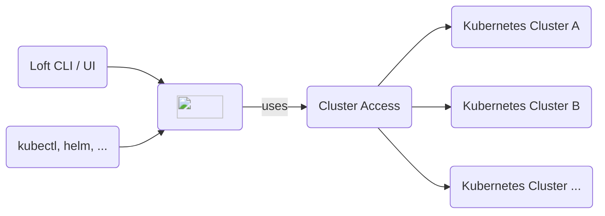

import Field from '@site/src/components/Field'
import APISpec from '@theme/ApiSchema'

Loft can be run in a single cluster but it can also run in one cluster but users work with other clusters that are connected to Loft.

## Configuration

### Metadata

#### Display Name
<Field crd="Cluster" jsonPath="spec.displayName" img={require('@site/static/media/v2/screenshots/clusters/field-display-name.png').default} />

#### Kubernetes Name
<Field crd="Cluster" jsonPath="metadata.name" img={require('@site/static/media/v2/screenshots/clusters/field-name.png').default} />

#### Description
<Field crd="Cluster" jsonPath="spec.description" img={require('@site/static/media/v2/screenshots/clusters/field-description.png').default} />

#### Labels
<Field crd="Cluster" jsonPath="metadata.labels" type="map[string]string" img={require('@site/static/media/v2/screenshots/clusters/field-labels.png').default} />

#### Annotations
<Field crd="Cluster" jsonPath="metadata.annotations" type="map[string]string" img={require('@site/static/media/v2/screenshots/clusters/field-annotations.png').default} />

### Kube-Config
<Field crd="Cluster" jsonPath="spec.config" type="SecretRef" img={require('@site/static/media/v2/screenshots/clusters/field-kube-config.png').default} />

### Default Templates

#### For Spaces
<Field crd="Cluster" jsonPath='metadata.annotations["space.loft.sh/default-template"]' img={require('@site/static/media/v2/screenshots/clusters/field-default-space-template.png').default} />

#### For Virtual Clusters
<Field crd="Cluster" jsonPath='metadata.annotations["virtualcluster.loft.sh/default-template"]' img={require('@site/static/media/v2/screenshots/clusters/field-default-virtual-cluster-template.png').default} />

### Loft Agent

#### Ignore Agent
<Field crd="Cluster" jsonPath='metadata.annotations["loft.sh/cluster-ignore-agent"]' img={require('@site/static/media/v2/screenshots/clusters/field-agent-ignore.png').default} />

#### Agent Values
<Field crd="Cluster" jsonPath='metadata.annotations["loft.sh/agent-values"]' img={require('@site/static/media/v2/screenshots/clusters/field-agent-values.png').default} />

### Direct Cluster Endpoint
<Field crd="Cluster" jsonPath='metadata.annotations["loft.sh/direct-cluster-endpoint"]' img={require('@site/static/media/v2/screenshots/clusters/field-direct-cluster-endpoint.png').default} />

#### Insecure Endpoint
<Field crd="Cluster" jsonPath='metadata.annotations["loft.sh/direct-cluster-endpoint-insecure"]' img={require('@site/static/media/v2/screenshots/clusters/field-endpoint-insecure.png').default} />

#### CA Certificate
<Field crd="Cluster" jsonPath='metadata.annotations["loft.sh/direct-cluster-endpoint-ca-data"]' img={require('@site/static/media/v2/screenshots/clusters/field-endpoint-ca-cert.png').default} />

### Access To Cluster
<Field crd="Cluster" jsonPath="spec.access" type="Access[]" img={require('@site/static/media/v2/screenshots/clusters/field-access.png').default} />

## CRDs

### `Cluster`
<APISpec pointer="#/components/schemas/com.github.loft-sh.api.pkg.apis.management.v1.Cluster" />
