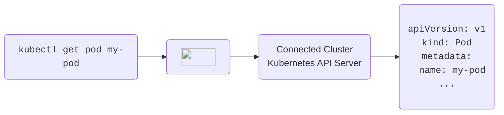

All requests that are made through Loft count as activity in the {props.name}.

If your kube-context points to Loft's API server as a proxy before the actual connected cluster's API server, every `kubectl` request will be an activity and reset the inactivity timeout.

### Ingress Requests

For ingress-nginx based ingresses, activity detection also works automatically. Other ingress controllers are currently not supported. For nginx based ingresses, Loft will add a special annotation to each ingress that will track activity and reset the timer as soon as a request is made to that ingress.

:::info Ingress Wakeup
Loft supports waking up a {props.name} through an ingress independent of the underlying ingress controller. Just navigate to the ingress host and you should see a Loft wakeup page for the {props.name}.
:::
