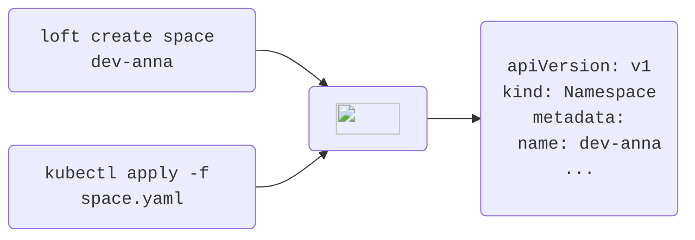

```mermaid
flowchart LR;
  CLI("<code>loft create space dev-anna</code>") --> Loft
  kubectl("<code>kubectl apply -f space.yaml</code>") --> Loft

  Loft("<img src='/docs/media/loft-logo-white.svg' width='60' height='30' />")
  
  Loft --> Namespace("<pre>apiVersion: v1\nkind: Namespace\nmetadata:\n  name: dev-anna\n...</pre>")

  class CLI,kubectl code
  class Namespace yaml
  class Loft loft
```